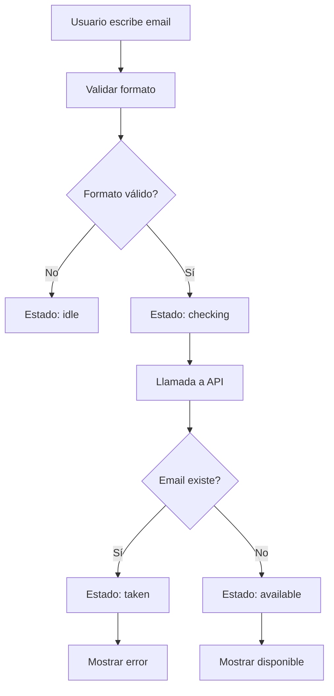

# 🔧 Corrección de Verificación de Email en PostgreSQL

## 📋 Problema Identificado

### **Lógica Invertida en el Registro**
El código original tenía una lógica invertida que causaba confusión:

```typescript
// ❌ CÓDIGO INCORRECTO (Antes)
const existingUser = await Usuario.findOne({ 
  where: { email: email.toLowerCase() } 
});
if (!existingUser) {
  return res.status(409).json({ 
    message: "El correo electrónico NO está registrado, no puedes usarlo" 
  });
}
```

### **Problemas Detectados**
1. **Lógica invertida**: Rechazaba correos que NO existían
2. **Mensaje confuso**: Indicaba que no se podía usar un correo no registrado
3. **Verificación simulada**: El frontend usaba simulación en lugar de verificación real

## ✅ Solución Implementada

### **1. Corrección de la Lógica de Registro**

```typescript
// ✅ CÓDIGO CORREGIDO (Después)
const existingUser = await Usuario.findOne({ 
  where: { email: email.toLowerCase() } 
});
if (existingUser) {
  console.log('❌ Usuario YA existe en PostgreSQL:', email);
  return res.status(409).json({ 
    message: "El correo electrónico ya está registrado" 
  });
}
```

### **2. Nuevo Endpoint para Verificación de Email**

```typescript
// Nuevo endpoint: GET /api/check-email
export const checkEmailAvailability = async (req: Request, res: Response) => {
  try {
    const { email } = req.query;
    
    if (!email || typeof email !== 'string') {
      return res.status(400).json({ 
        message: "El parámetro email es requerido y debe ser una cadena de texto" 
      });
    }

    const existingUser = await Usuario.findOne({ 
      where: { email: email.toLowerCase() } 
    });

    const isAvailable = !existingUser;
    
    res.json({
      success: true,
      email: email.toLowerCase(),
      isAvailable,
      message: isAvailable 
        ? "Email disponible para registro" 
        : "Email ya está registrado"
    });
  } catch (error) {
    res.status(500).json({ message: "Error interno del servidor" });
  }
};
```

### **3. Servicio Frontend Mejorado**

```javascript
// Frontend/src/components/services/emailService.js
export const checkEmailAvailability = async (email) => {
  try {
    const response = await fetch(`${API_CONFIG.BASE_URL}/check-email?email=${encodeURIComponent(email)}`);
    
    if (!response.ok) {
      throw new Error('Error en la verificación de email');
    }
    
    const data = await response.json();
    return data;
  } catch (error) {
    console.error('Error verificando disponibilidad de email:', error);
    throw error;
  }
};

// Función con debounce para evitar muchas llamadas
export const checkEmailWithDebounce = debounce(async (email, setEmailStatus) => {
  if (!validateEmailFormat(email)) {
    setEmailStatus('idle');
    return;
  }

  setEmailStatus('checking');
  
  try {
    const data = await checkEmailAvailability(email);
    setEmailStatus(data.isAvailable ? 'available' : 'taken');
  } catch (error) {
    console.error('Error en verificación de email:', error);
    setEmailStatus('idle');
  }
}, 500);
```

## 🚀 Nuevas Funcionalidades

### **1. Verificación en Tiempo Real**
- El frontend verifica la disponibilidad del email mientras el usuario escribe
- Debounce de 500ms para evitar demasiadas llamadas a la API
- Indicadores visuales de estado (checking, available, taken)

### **2. Validación Robusta**
- Verificación de formato de email en el frontend
- Validación de tipo de datos en el backend
- Manejo de errores en ambos lados

### **3. Endpoint Público**
- `GET /api/check-email?email=usuario@ejemplo.com`
- Respuesta JSON con información de disponibilidad
- No requiere autenticación

## 📊 Flujo de Verificación



## 🧪 Pruebas

### **Script de Pruebas**
```bash
# Ejecutar pruebas de verificación de email
node Backend/test-email-check.js
```

### **Casos de Prueba**
1. **Email no registrado**: Debe retornar `isAvailable: true`
2. **Email registrado**: Debe retornar `isAvailable: false`
3. **Formato inválido**: Debe retornar error 400
4. **Sin parámetro**: Debe retornar error 400

## 🔄 Cambios en Archivos

### **Backend**
- `src/Controllers/usercontroller.ts`: Corregida lógica de registro y agregado endpoint
- `src/Rutas/rutas.ts`: Agregada ruta para verificación de email

### **Frontend**
- `src/components/auth/RegisterForm.jsx`: Integrado servicio real
- `src/components/services/emailService.js`: Nuevo servicio con debounce

### **Pruebas**
- `test-email-check.js`: Script de pruebas automatizadas

## 📈 Beneficios

1. **Experiencia de Usuario Mejorada**: Verificación en tiempo real
2. **Prevención de Errores**: Validación antes del envío del formulario
3. **Rendimiento Optimizado**: Debounce para reducir llamadas a la API
4. **Código Más Limpio**: Lógica corregida y bien estructurada
5. **Mantenibilidad**: Código más fácil de entender y mantener

## 🚨 Consideraciones de Seguridad

1. **Rate Limiting**: Considerar implementar límites de velocidad para el endpoint
2. **Validación**: Validación tanto en frontend como backend
3. **Logs**: Registro de intentos de verificación para auditoría
4. **CORS**: Configuración adecuada para el endpoint público

## 🔮 Próximos Pasos

1. **Implementar Rate Limiting** para el endpoint de verificación
2. **Agregar Métricas** para monitorear el uso del endpoint
3. **Optimizar Consultas** con índices en la base de datos
4. **Agregar Tests Unitarios** para el nuevo endpoint 