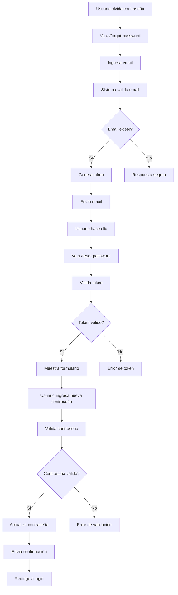

# 🔐 Implementación de Restablecimiento de Contraseña

## 📋 Funcionalidad Implementada

### **Flujo Completo de Restablecimiento**
1. **Usuario solicita restablecimiento** → Ingresa email en `/forgot-password`
2. **Sistema valida email** → Busca usuario en PostgreSQL
3. **Genera token temporal** → Token válido por 1 hora
4. **Envía email** → Con enlace para restablecer contraseña
5. **Usuario hace clic** → Va a `/reset-password?token=xxx`
6. **Sistema valida token** → Verifica que no haya expirado
7. **Usuario ingresa nueva contraseña** → Con validaciones robustas
8. **Sistema actualiza contraseña** → Encripta y guarda en PostgreSQL
9. **Envía confirmación** → Email de confirmación de cambio

## 🚀 Nuevas Funcionalidades

### **1. Backend - Nuevos Endpoints**

#### **POST /api/forgot-password**
```typescript
// Solicitar restablecimiento de contraseña
export const requestPasswordReset = async (req: Request, res: Response) => {
  // Valida email
  // Busca usuario en PostgreSQL
  // Genera token temporal (1 hora)
  // Envía email con enlace
  // Respuesta segura (no revela si email existe)
};
```

#### **POST /api/reset-password**
```typescript
// Restablecer contraseña con token
export const resetPassword = async (req: Request, res: Response) => {
  // Valida token
  // Valida nueva contraseña
  // Encripta contraseña
  // Actualiza en PostgreSQL
  // Envía email de confirmación
};
```

#### **GET /api/verify-reset-token/:token**
```typescript
// Verificar validez del token
export const verifyResetToken = async (req: Request, res: Response) => {
  // Verifica token no expirado
  // Retorna email asociado
};
```

### **2. Frontend - Nuevas Páginas**

#### **ForgotPasswordPage**
- Formulario para ingresar email
- Validación de formato de email
- Mensajes de éxito/error
- Navegación a login/registro

#### **ResetPasswordPage**
- Verificación automática de token
- Formulario con nueva contraseña
- Validaciones robustas de contraseña
- Indicadores visuales de políticas
- Redirección automática al login

### **3. EmailService - Nuevas Funciones**

#### **sendPasswordResetEmail**
- Email HTML con diseño profesional
- Enlace de restablecimiento
- Información de seguridad
- Modo desarrollo (simulación)

#### **sendPasswordChangedEmail**
- Confirmación de cambio exitoso
- Información de seguridad
- Instrucciones para soporte

## 📊 Flujo de Usuario



## 🔒 Seguridad Implementada

### **1. Tokens Seguros**
- **Generación**: 32 bytes aleatorios
- **Expiración**: 1 hora automática
- **Almacenamiento**: En PostgreSQL con timestamp
- **Limpieza**: Se eliminan después de uso

### **2. Validaciones Robustas**
- **Email**: Formato válido y existencia
- **Contraseña**: Mínimo 8 caracteres, mayúsculas, minúsculas, números, caracteres especiales
- **Token**: Verificación de validez y expiración
- **Confirmación**: Las contraseñas deben coincidir

### **3. Privacidad**
- **Respuestas seguras**: No revela si email existe
- **Logs limitados**: Información mínima en logs
- **Tokens únicos**: No reutilizables

## 📧 Emails Implementados

### **1. Email de Restablecimiento**
```html
- Diseño profesional con gradientes
- Botón de acción prominente
- Información de seguridad
- Enlace alternativo
- Advertencias importantes
```

### **2. Email de Confirmación**
```html
- Confirmación de cambio exitoso
- Lista de características de seguridad
- Información de soporte
- Instrucciones adicionales
```

## 🧪 Pruebas Implementadas

### **Script de Pruebas**
```bash
# Ejecutar pruebas de restablecimiento
node Backend/test-password-reset.js
```

### **Casos de Prueba**
1. **Email válido**: Debe enviar email de restablecimiento
2. **Email inválido**: Debe dar respuesta segura
3. **Sin email**: Debe dar error de validación
4. **Token inválido**: Debe rechazar restablecimiento
5. **Contraseña débil**: Debe rechazar contraseña

## 🔄 Archivos Modificados

### **Backend**
- `src/Controllers/usercontroller.ts`: Nuevas funciones de restablecimiento
- `src/Services/EmailService.ts`: Emails de restablecimiento
- `src/Rutas/rutas.ts`: Nuevas rutas agregadas

### **Frontend**
- `src/components/auth/ForgotPasswordPage.jsx`: Nueva página
- `src/components/auth/ResetPasswordPage.jsx`: Nueva página
- `src/components/auth/LoginForm.jsx`: Botón funcional
- `src/App.jsx`: Nuevas rutas agregadas

### **Pruebas**
- `test-password-reset.js`: Script de pruebas automatizadas

## 📈 Beneficios

1. **Experiencia de Usuario**: Proceso intuitivo y claro
2. **Seguridad**: Tokens temporales y validaciones robustas
3. **Privacidad**: No revela información sensible
4. **Confiabilidad**: Manejo de errores completo
5. **Accesibilidad**: Diseño responsive y accesible

## 🚨 Consideraciones de Seguridad

1. **Rate Limiting**: Considerar límites para prevenir spam
2. **Logs de Auditoría**: Registrar intentos de restablecimiento
3. **Notificaciones**: Alertar sobre cambios de contraseña
4. **Monitoreo**: Detectar patrones sospechosos

## 🔮 Próximos Pasos

1. **Implementar Rate Limiting** para prevenir abuso
2. **Agregar Métricas** para monitorear uso
3. **Implementar Notificaciones** de seguridad
4. **Agregar Tests Unitarios** completos
5. **Optimizar Emails** para diferentes clientes

## 📝 Uso en Desarrollo

### **1. Probar Funcionalidad**
```bash
# 1. Iniciar servidor backend
cd Backend && npm run dev

# 2. Iniciar frontend
cd Frontend && npm run dev

# 3. Registrar un usuario
# 4. Ir a login y hacer clic en "¿Olvidaste tu contraseña?"
# 5. Seguir el flujo completo
```

### **2. Verificar Emails**
```bash
# En modo desarrollo, los emails se simulan
# Revisar logs del servidor para ver tokens y URLs
```

### **3. Ejecutar Pruebas**
```bash
# Ejecutar script de pruebas
node Backend/test-password-reset.js
```

## 🎯 Características Destacadas

- ✅ **Flujo completo** de restablecimiento
- ✅ **Validaciones robustas** de contraseña
- ✅ **Emails profesionales** con diseño HTML
- ✅ **Seguridad implementada** con tokens temporales
- ✅ **Interfaz intuitiva** con feedback claro
- ✅ **Manejo de errores** completo
- ✅ **Privacidad protegida** (no revela información)
- ✅ **Pruebas automatizadas** incluidas

La funcionalidad de restablecimiento de contraseña está completamente implementada y lista para usar! 🎉 